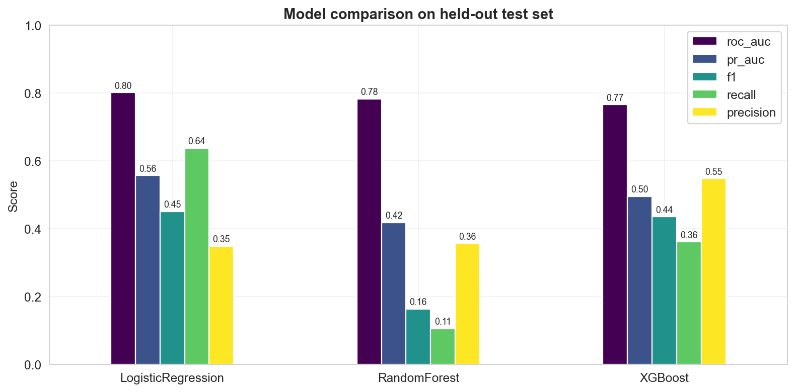
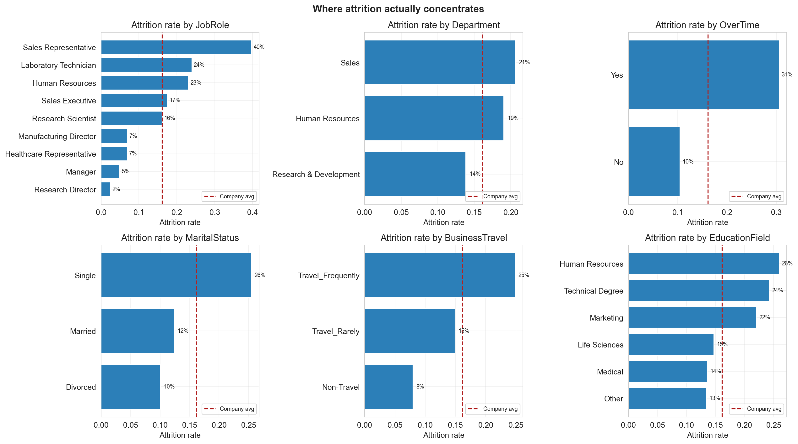
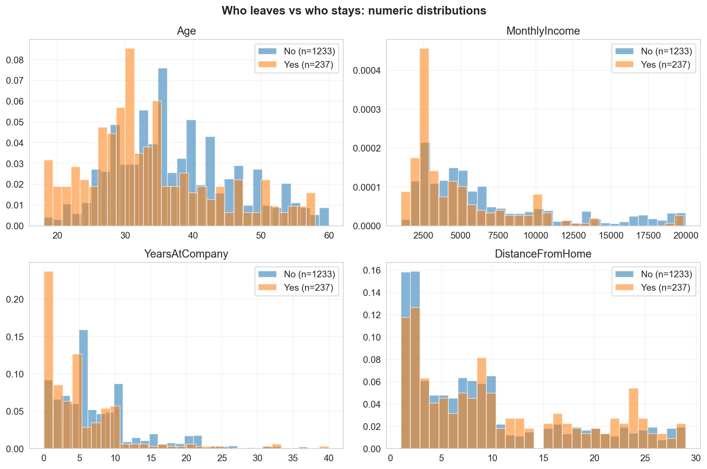
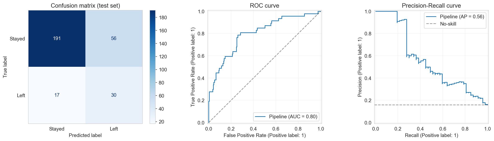
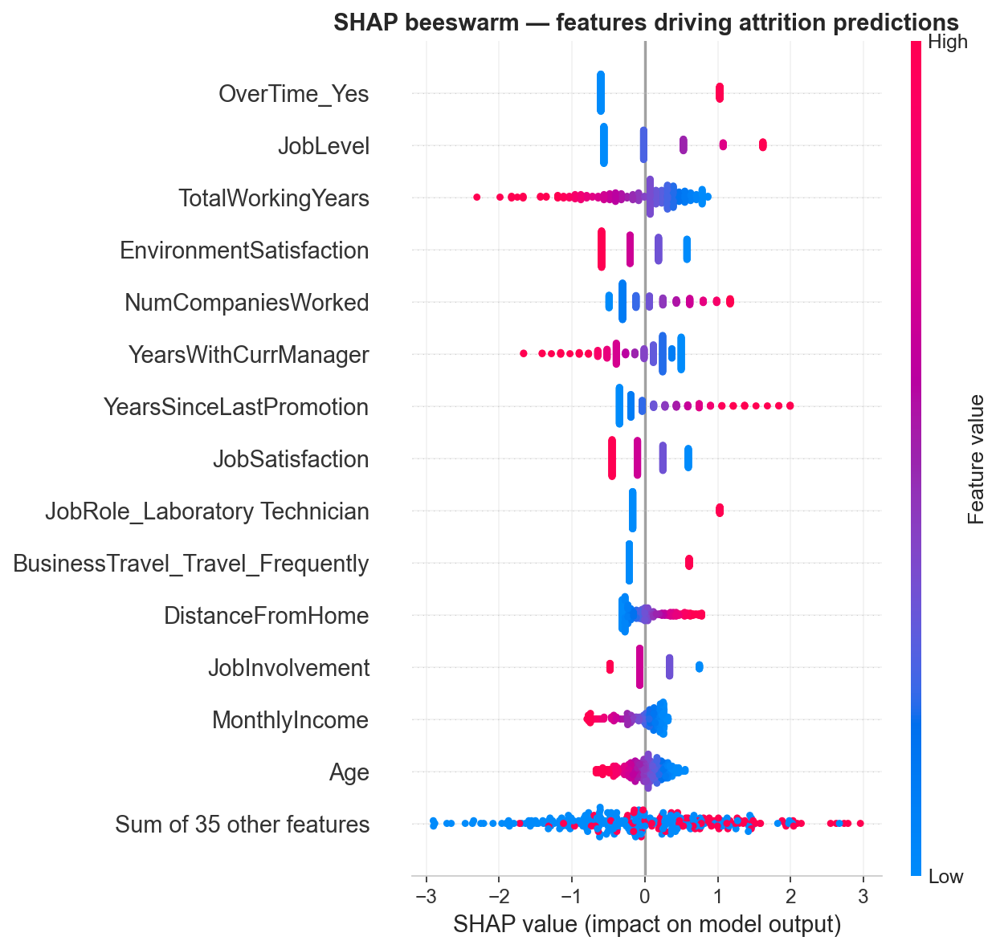
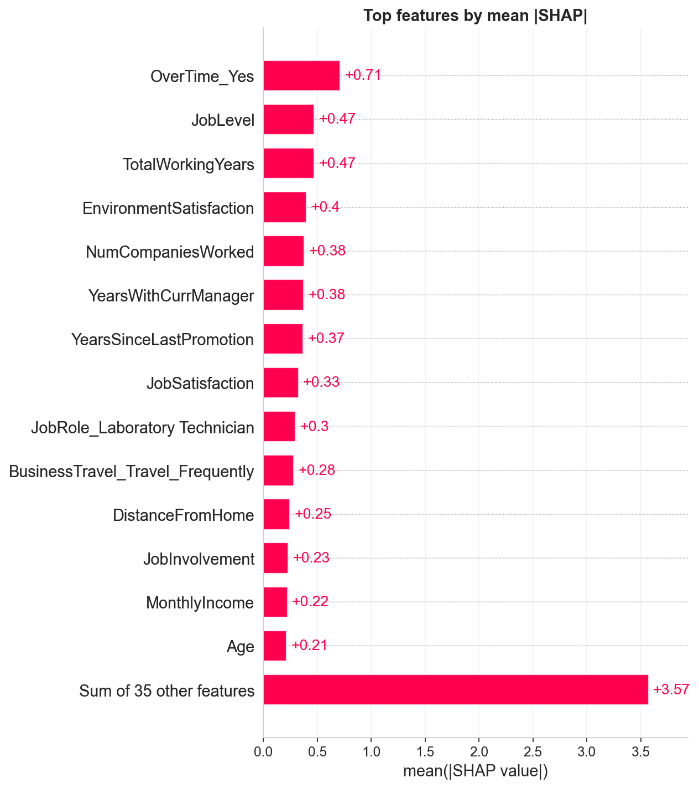

# HR Attrition Predictor

Responsible retention risk modeling and workforce stability decision support. Predicts voluntary attrition from standard HR data and explains each prediction with per-individual SHAP attributions, so HR business partners get conversation-ready drivers rather than opaque scores.

**[Live dashboard →](https://hr-attrition-predictor-jotterson.streamlit.app/)** (no install required)



---

## The business problem

Unwanted attrition is one of the most expensive things an employer does badly. Replacement cost for an individual contributor is typically **0.5–2x annual salary**; for specialized or leadership roles it can exceed **2x**. At a 10,000-person firm with industry-average 16% turnover and a $95K average salary, a **2 percentage-point reduction in attrition** is roughly **$19M–$38M in retained value per year**.

The difficulty isn't spotting turnover *after the fact* — HR dashboards already do that. The difficulty is **spotting it early enough to intervene, with enough specificity that an HRBP can have a real conversation** rather than a generic one.

That's what this project demonstrates.

---

## What's in this repo

| Component | What it shows |
|---|---|
| `src/data.py` | Data loading, cleaning, and reproducible preprocessing (`ColumnTransformer` with scaler + one-hot encoder). |
| `src/train.py` | Trains and benchmarks three models (Logistic Regression, Random Forest, XGBoost). 80/20 stratified split + 5-fold stratified CV. |
| `src/explain.py` | SHAP-based explainability — global and per-individual feature attributions. |
| `src/visualize.py` | Generates every figure in this README from the trained model. |
| `notebooks/01_eda_and_modeling.ipynb` | Analyst-style walkthrough: EDA → modeling → SHAP → operational recommendations. |
| `app/streamlit_app.py` | Interactive demo — enter an employee profile, get a risk band and the top 10 drivers behind the score. |

---

## Dataset

**IBM HR Analytics Employee Attrition & Performance** — 1,470 employees, 35 features spanning demographics, compensation, role, tenure, satisfaction scores, and binary attrition label. Publicly available; widely used as a benchmark for HR modeling.

- **Target**: `Attrition` (Yes/No)
- **Base rate**: ~16.1% attrition
- **Stratified 80/20 split**, seed = 42

### Feature schema

| Category | Features |
|---|---|
| **Demographics** | Age, Gender, MaritalStatus, DistanceFromHome |
| **Job context** | JobRole, Department, JobLevel (1-5), BusinessTravel, OverTime |
| **Tenure** | YearsAtCompany, YearsInCurrentRole, YearsWithCurrManager, YearsSinceLastPromotion, TotalWorkingYears, NumCompaniesWorked |
| **Compensation** | MonthlyIncome, HourlyRate, DailyRate, PercentSalaryHike, StockOptionLevel (0-3) |
| **Engagement** | JobSatisfaction (1-4), EnvironmentSatisfaction (1-4), WorkLifeBalance (1-4), RelationshipSatisfaction (1-4), JobInvolvement (1-4) |
| **Performance** | PerformanceRating, TrainingTimesLastYear |
| **Education** | Education (1-5), EducationField |

Four constant/identifier columns (`EmployeeCount`, `Over18`, `StandardHours`, `EmployeeNumber`) are dropped before modeling since they carry no signal.

### Where attrition actually concentrates



Two findings to highlight — both consistent with what any experienced HR practitioner would expect, and exactly the signals a good model should pick up on:

- **OverTime = Yes → ~31% attrition** vs ~10% for non-OT employees. This is the single sharpest split in the dataset.
- **Sales Representative, Research Scientist (early-career), Lab Technician** show role-specific risk that sits above the company average regardless of individual attributes.



The numeric distributions tell the tenure / pay / age story: leavers skew younger, shorter-tenured, lower-income, and live farther from the office — the classic first-3-year cliff pattern.

---

## How each model makes a decision

Each of the three benchmarked models arrives at a prediction differently. Understanding the mechanics matters for interpretation and for defending the choice to HR stakeholders.

**Logistic Regression (selected model).** Assigns a numeric weight to each feature and computes a weighted sum for every employee. That sum is passed through a sigmoid function to produce a probability between 0 and 1. For this dataset, `OverTime=Yes` carries a large positive weight (pushing the probability toward 1, i.e. attrition), while `StockOptionLevel=3` carries a negative weight (pushing toward 0). The final prediction is the sum of these contributions, squashed into a probability. The coefficients are directly inspectable, which is why HR teams tend to trust this class of model when the performance is competitive.

**Random Forest.** Builds an ensemble of 400 decision trees, each trained on a bootstrap sample of the data with a random subset of features at each split. Each tree casts a Yes/No vote for a given employee, and the final probability is the proportion of trees voting Yes. Individual trees are high-variance; averaging across 400 stabilizes the prediction. The mechanism handles non-linear interactions automatically (e.g. "high overtime *and* low job satisfaction" is worse than either alone), but the ensemble as a whole is harder to explain to non-technical stakeholders.

**XGBoost.** Builds 400 trees *sequentially* rather than independently. Each new tree is trained specifically to correct the errors made by the ensemble so far. Early trees learn the obvious patterns (OverTime, tenure); later trees learn the subtle interactions and edge cases. Typically the strongest performer on structured tabular data, though it requires more data than this dataset provides to meaningfully outperform logistic regression.

All three use `class_weight="balanced"` (or `scale_pos_weight` for XGBoost) to counteract the 84/16 class imbalance — otherwise every model would learn to predict "stays" for everyone and score ~84% accuracy while being useless.

## Model performance

Held-out test set (294 employees, 47 positives):

| Model | ROC-AUC | PR-AUC | Recall | Precision | F1 | Brier |
|---|---:|---:|---:|---:|---:|---:|
| **Logistic Regression** *(selected)* | **0.802** | 0.557 | 0.638 | 0.349 | 0.451 | 0.156 |
| Random Forest | 0.783 | 0.419 | 0.106 | 0.357 | 0.164 | 0.117 |
| XGBoost | 0.766 | 0.496 | 0.362 | 0.548 | 0.436 | 0.116 |

5-fold CV on training fold confirmed stability (all three ≥ 0.80 ± 0.03).

### Why logistic regression wins here

Three reasons, and I think this is the more important finding than "we beat the benchmark":

1. **With `class_weight="balanced"` and proper preprocessing, a well-specified linear model is hard to beat on a dataset this size (n=1,470).** Tree ensembles want more rows to diverge meaningfully.
2. **Recall matters more than precision** for retention work — missing someone who leaves is much costlier than flagging someone who doesn't. LR's 0.64 recall is the strongest of the three at the default threshold.
3. **Coefficients are directly interpretable by HR stakeholders**, which matters for adoption.

### Evaluation curves



---

## Why the model predicts what it does — SHAP

Any model used in HR must be explainable per-individual, not just in aggregate. SHAP gives both:

### Global: what drives attrition in this workforce



Ranked by mean absolute contribution to predictions (top features):



**The signal confirms what any seasoned HR practitioner would expect:**

| Feature | Direction | Interpretation |
|---|---|---|
| **OverTime = Yes** | ↑ attrition | By far the strongest single lever — burnout signal. |
| **StockOptionLevel = 0** | ↑ attrition | Absence of equity compounds with other risks. |
| **JobRole = Sales Representative** | ↑ attrition | Role-level risk independent of individual traits. |
| **YearsAtCompany (low)** | ↑ attrition | Classic first-3-year cliff. |
| **MonthlyIncome (low)** | ↑ attrition | Pay-band effect at lower levels. |
| **BusinessTravel = Frequently** | ↑ attrition | Life/travel friction. |
| **Age (younger)** | ↑ attrition | Confounded with tenure; still significant. |

### Per-individual: why *this* employee

SHAP values answer the question: *"For this specific employee, how much did each feature contribute to the predicted probability?"*

A SHAP value has two properties:
- **Sign**: positive means the feature pushed the prediction toward attrition; negative means toward retention.
- **Magnitude**: the size of the push, expressed in log-odds units (for logistic regression) or probability units directly.

A worked example. Suppose the model assigns Employee #42 an attrition probability of 78%. The SHAP breakdown might look like:

| Feature | Value | SHAP contribution | Direction |
|---|---|---:|---|
| Baseline (population average) | — | +0.18 | starting point |
| OverTime | Yes | +0.22 | ↑ attrition |
| YearsAtCompany | 1 | +0.14 | ↑ attrition (first-3-year cliff) |
| JobSatisfaction | 1 (lowest) | +0.11 | ↑ attrition |
| MonthlyIncome | $3,200 | +0.08 | ↑ attrition (below median for role) |
| Age | 28 | +0.05 | ↑ attrition |
| *(remaining features)* | — | 0.00 | neutral |
| **Predicted probability** | — | **0.78** | **High risk** |

The contributions add up to the model's actual prediction. This is what makes the score actionable: an HRBP can surface the top three drivers for a flagged employee and have a specific conversation with that employee's manager — rather than producing a black-box number and hoping the manager knows what to do with it.

---

## Interactive dashboard

A multi-page Streamlit app ships with the repo. [Try the live version](https://hr-attrition-predictor-jotterson.streamlit.app/) or run it locally.

### Home page

- KPI strip: workforce size, currently attrited count and rate, count of high-risk employees (probability ≥ 60%), median tenure of leavers, selected model
- Snapshot bar charts: attrition rate by job role, attrition rate by department

### Workforce Dashboard

The aggregate view a People Analytics team would use in a quarterly review.

- **Filters**: job role (multi-select), department (multi-select), overtime status, business travel frequency, predicted-risk range slider
- **Live KPIs**: filtered employee count, average predicted risk, high-risk employee count, median tenure and income
- **Risk distribution histogram** across the filtered population
- **Risk band mix table**: count and percentage in Low / Medium / High bands
- **Segment analysis**: four tabs (Job Role, Department, Overtime, Tenure bucket) showing per-segment employee count, average risk, count of high-risk employees, percentage high-risk — formatted with a red gradient so the worst segments jump out
- **Top 20 highest-risk employees table** with role, department, tenure, overtime flag, income, travel, age
- **CSV exports**: filtered data and top-20 flagged employees

### Individual Scoring

Score a specific employee profile.

- Sidebar form for all 30 features, pre-populated with population median (numeric) and mode (categorical)
- Click "Score this employee" to generate:
  - Attrition probability percentage
  - Risk band (High / Medium / Low) with recommended action
  - Top 10 features ranked by absolute SHAP contribution, with direction indicator and value color-graded (red for ↑ risk, blue for ↓ risk)

```bash
pip install -r requirements.txt
python -m src.train        # train models (~30 seconds)
python -m src.visualize    # regenerate docs/ figures
streamlit run app/streamlit_app.py
```

**Tableau / Power BI / Looker users:** generate a Tableau-ready CSV:
```bash
python -m src.export_tableau   # writes tableau/attrition_scored.csv
```
Then follow [docs/TABLEAU.md](docs/TABLEAU.md) for the recipe to build six dashboard views from the exported CSV.

### Run the notebook

```bash
jupyter lab notebooks/01_eda_and_modeling.ipynb
```

---

## How I'd use this in practice

I've sat on the hiring side of thousands of requisitions. Predictions alone don't retain anyone. A model like this creates value only when it's wired into a workflow:

| Use case | How the score is used |
|---|---|
| **Manager 1:1 prep** | Surface an employee's top 3 SHAP drivers to enable a specific conversation, not a generic "stay interview." |
| **Org-level intervention** | Compare SHAP distributions across teams — flag teams where `OverTime` is the systemic driver and route to the HRBP + team lead. |
| **Retention investment prioritization** | Rank high-value / high-risk employees and estimate dollar impact of moving them from high- to medium-risk. |
| **Compensation equity cross-check** | Low-income × high-risk × under-promoted employees feed into the comp-equity audit (see [compensation-equity-analysis](https://github.com/Jott2121/compensation-equity-analysis) when published). |

**Explicitly not appropriate:**

- Adverse employment decisions (PIPs, RIFs) based on the score. Bias risk is real on HR data — this is decision *support*, not decision *making*.
- Surfacing individual scores to employees without HR and legal review.
- Using the probability without the SHAP explanation alongside it.

---

## Enterprise deployment

This project is structured as a decision-support tool, not a production system. The notes below document what would change in an enterprise rollout.

### Source system mapping

| Feature category | Production source |
|---|---|
| Demographics, tenure, comp | HRIS Worker table (Workday / Oracle HCM / SAP SuccessFactors) |
| Engagement & satisfaction | Engagement survey platform (Glint / Qualtrics EmployeeXM / Culture Amp) |
| Performance & calibration | HRIS `Performance_Review` + calibration workflow exports |
| Training & certifications | LMS (Cornerstone / Workday Learning / Degreed) |
| Manager / org hierarchy | HRIS reporting tree, refreshed on org change events |

Skill family and business unit are rarely clean in native HRIS — they typically require a job-architecture mapping maintained by HR operations.

### Data quality checks

Before a score is produced, the pipeline should enforce:

- **Required fields non-null**: job role, department, level, tenure, compensation
- **Duplicate detection** on employee ID across integration refreshes
- **Business-unit and job-family canonicalization** — subsidiary / legacy-name consolidation
- **Outlier handling on tenure and comp** — entries outside plausible ranges quarantined, not silently included
- **Engagement survey age**: scores older than 12 months flagged as stale
- **Refresh cadence**: weekly for workforce dashboard use; daily isn't necessary for retention work

### Governance and security

- **Role-based access**: HRBPs see only employees in their assigned business unit; TA and total rewards partners see their portfolio only; People Analytics sees enterprise-wide aggregates. Employee-level scores never flow to peers or direct reports.
- **PII handling**: the model uses demographic inputs (age, gender, marital status) only where legally permissible and operationally justified. A production deployment should run a separate no-demographics variant and compare outputs; if demographic inputs don't meaningfully improve calibration, they should be removed to reduce legal exposure.
- **Explainability requirement**: every individual score must surface SHAP drivers. A probability without its explanation is not a permitted output.
- **Audit log**: every score request records requester, employee viewed, timestamp, and model version.
- **Legal review**: required before any HRBP acts on a specific score, and again annually on the model itself.

### Model monitoring

- **Drift**: compare predicted vs actual attrition monthly; alert if Brier score degrades > 0.02 or if base-rate estimate drifts > 3 pp.
- **Retraining**: quarterly retraining on trailing 24 months of data; monthly if the workforce has undergone a material org change (acquisition, divestiture, RIF).
- **Bias monitoring**: run subgroup-fairness checks (equalized odds across gender, race where available, age bands) on every retraining. Document any disparity and the remediation plan.
- **Threshold review**: the 0.60 High-risk threshold is an assumption, not a fact. Review it annually against actual intervention outcomes.
- **Change log**: every feature change, hyperparameter change, or threshold change is logged with rationale and approval.

### Legal review points

- **Adverse-action restriction**: outputs cannot be used for termination, PIP, demotion, or RIF selection. This must be explicit in the tool's terms of use and communicated to HRBPs at rollout.
- **Individual disclosure**: employees have the right (in many jurisdictions, the legal requirement) to understand how automated decisions affect them. Any process that surfaces a retention-risk score to the employee requires legal and HR sign-off on the disclosure language.
- **Cross-border deployment**: GDPR Article 22, EU AI Act (high-risk HR systems), state-level US laws (Illinois, New York), and sectoral regulations vary significantly. Each jurisdiction needs its own review.

### User roles

| Role | Permitted use |
|---|---|
| HR Business Partners | View scores for employees in their BU; use SHAP drivers to prepare manager conversations |
| Talent Acquisition leaders | Aggregate risk trends in their portfolio for succession and backfill planning |
| Total Rewards | Cross-reference low-comp × high-risk employees against comp equity audit outputs |
| People Analytics | Maintain, monitor, and retrain the model; investigate drift and bias |
| Managers | See their direct team's aggregate risk posture — not individual scores |
| Executives | Enterprise-wide and BU-level aggregates only |

---

## Repo layout

```
hr-attrition-predictor/
├── data/hr_attrition.csv        # IBM HR Analytics dataset (1,470 rows)
├── src/
│   ├── data.py                  # Loading, cleaning, preprocessing pipeline
│   ├── train.py                 # Train & benchmark LR / RF / XGBoost
│   ├── explain.py               # SHAP wrapper (works with any sklearn Pipeline)
│   └── visualize.py             # Generate all README figures
├── notebooks/
│   └── 01_eda_and_modeling.ipynb
├── app/streamlit_app.py         # Interactive demo
├── docs/                        # Generated PNGs referenced in this README
├── models/best_model.joblib     # Serialized best model (after training)
├── reports/metrics.json         # Full evaluation metrics
└── requirements.txt
```

---

## About

Part of a People Analytics portfolio covering workforce planning, recruiting, compensation equity, and retention. Companion repositories:

- [workforce-planning-demand-forecast](https://github.com/Jott2121/workforce-planning-demand-forecast) — strategic workforce planning and recruiter capacity
- [hiring-funnel-analytics](https://github.com/Jott2121/hiring-funnel-analytics) — recruiting funnel performance and bias monitoring
- [compensation-equity-analysis](https://github.com/Jott2121/compensation-equity-analysis) — regression-based pay equity audit

Maintainer: [Jeff Otterson](https://github.com/Jott2121). Dataset: IBM Watson Analytics (public); used under standard fair-use for research and demonstration. Libraries: `scikit-learn`, `xgboost`, `shap`, `pandas`, `streamlit`. MIT licensed.
